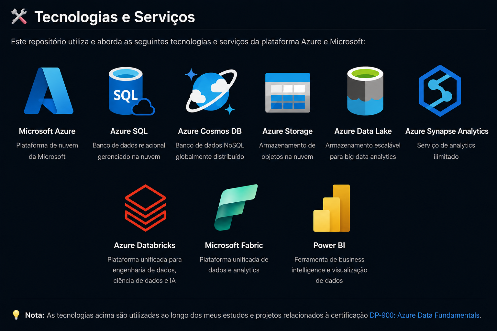

# 📘 DP-900 | Microsoft Azure Data Fundamentals

Bem-vindo(a) ao meu repositório de estudos para a certificação **Microsoft DP-900: Azure Data Fundamentals**.

Este repositório reúne minhas anotações, resumos, exercícios, laboratórios e materiais de apoio utilizados durante minha preparação para a certificação.

## 🎯 Objetivos

- Consolidar conhecimentos em fundamentos de dados
- Aprender os principais serviços de dados do Microsoft Azure
- Preparar-me para a certificação DP-900
- Compartilhar meu processo de aprendizagem

## 📚 Conteúdo

- ✅ Conceitos de Dados
- ✅ Bancos de Dados Relacionais
- ✅ Bancos de Dados Não Relacionais
- ✅ Azure SQL
- ✅ Azure Cosmos DB
- ✅ Azure Storage
- ✅ Azure Synapse Analytics
- ✅ Azure Databricks
- ✅ Microsoft Fabric
- ✅ Power BI
- ✅ Simulados e Questões

## 📂 Estrutura

| Módulo | Tema | Status | Link |
|---|---|---|---|
| 01 | Conceitos de Dados | ✅ Concluído | [Acessar](./01-Conceitos-de-Dados/README.md) |
| 02 | Tipos de Bancos de Dados | ⏳ Em andamento | [Acessar](./02-Tipos-de-Bancos-de-Dados/README.md) |
| 03 | Processamento Transacional e Analítico | ⏳ Em breve | - |
| 04 | Plataformas Modernas de Análise | ⏳ Em breve | - |
| 05 | Serviços de Dados no Azure | ⏳ Em breve | - |
| 06 | Power BI e Modelos Semânticos | ⏳ Em breve | - |
| 07 | Governança de Dados | ⏳ Em breve | - |
| 08 | Revisão Geral DP-900 | ⏳ Em breve | - |
| 09 | Simulados e Questões | ⏳ Em breve | - |

## 📅 Status

🚀 Em andamento

Última atualização: Junho de 2026.

---

⭐ Este repositório faz parte da minha jornada de desenvolvimento profissional em Análise e Engenharia de Dados.
